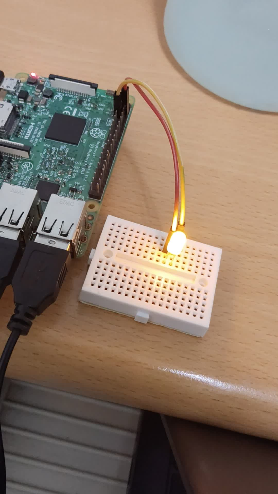
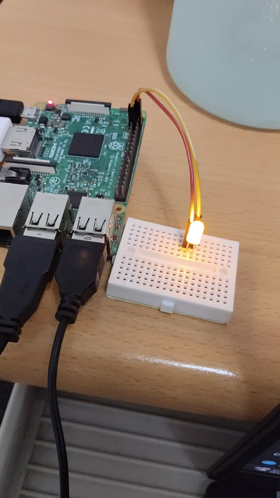

# Lab 9: Device Driver II 實驗報告

主題：使用 GPIO4 控制 LED 亮燈與持續閃爍

| 課程 / 實驗 | Lab 9: Device Driver II |
| --- | --- |
| 實驗平台 | Raspberry Pi 3 / Raspberry Pi OS 64-bit |
| GPIO 腳位 | GPIO4 = 實體 Pin 7；GND = 實體 Pin 6 |
| 主要套件 | gpiod、libgpiod-dev；本機版本為 libgpiod v2.2.1 |
| 學生 | 許禕恩 Ian Hsu |

影片附件說明：本報告附上兩段 DEMO 影片：影片 1 為老師 `test.c` 測試（LED 亮 2 秒後熄滅），影片 2 為 `blink_demo` 持續閃爍。影片檔與本報告一起放在壓縮檔中。

## 一、實驗目的

- 理解 GPIO（General Purpose Input/Output）可作為輸入或輸出使用，並以輸出模式控制外部 LED。
- 依照講義指定的 GPIO4 與 GND 腳位完成 LED 硬體接線。
- 安裝並使用 libgpiod 工具與 C 語言 API，完成 LED 亮燈測試與持續閃爍 DEMO。
- 解決 libgpiod v1 與 v2 API 不相容、DNS / apt 更新失敗、腳位接錯與麵包板接線等問題。

## 二、PPT / 講義問題整理與回答

| 題目 / 重點 | 回答 | 本次實作對應 |
| --- | --- | --- |
| GPIO 是什麼？ | GPIO 是 General Purpose Input/Output，可由程式控制腳位讀取訊號或輸出電位。 | 本次將 GPIO4 設為輸出，控制 LED 亮與滅。 |
| GPIO 有哪兩種基本模式？ | Input 與 Output。Input 用來讀取腳位高低電位；Output 用來輸出高低電位。 | 使用 Output 模式將 GPIO4 設為 active/inactive。 |
| 本實驗使用哪兩個腳位？ | GPIO4 與 GND。GPIO4 對應實體 Pin 7，GND 使用實體 Pin 6。 | Pin 7 接 LED 正極端，Pin 6 接 LED 負極端。 |
| 可以用哪些方式控制 GPIO？ | 講義列出 sysfs interface 與 libgpiod。 | 本次採用 libgpiod v2 的 C API。 |
| libgpiod 工具有哪些？ | `gpiodetect` 可列出 GPIO 控制器，`gpioinfo` 可看 GPIO line 狀態，`gpioset` 可設定 GPIO 輸出值，`gpioget` 可讀值。 | 用 `gpiodetect --version` 確認版本，`gpioinfo` 確認 GPIO4 存在。 |
| 如何編譯 C 程式？ | 使用 `gcc` 加上 `-lgpiod` 連結 libgpiod。 | `gcc test.c -o test -lgpiod`；`gcc blink_demo.c -o blink_demo -lgpiod`。 |
| DEMO 要求是什麼？ | 請同學寫一個 C 程式，讓 LED 燈可以持續閃爍。 | 完成 `blink_demo.c`，透過 `while` 迴圈使 LED 每 1 秒亮、每 1 秒暗，直到 `Ctrl+C` 停止。 |

## 三、實驗器材與環境

- Raspberry Pi 3 Model B V1.2。
- Raspberry Pi OS 64-bit（系統顯示 Debian GNU/Linux 13 trixie）。
- LED、杜邦線、麵包板；正式接線建議加入 220Ω 或 330Ω 電阻保護 LED 與 GPIO。
- libgpiod v2.2.1、gpiod command-line tools、gcc。

## 四、實驗流程

1. 保留 Lab7 / Lab8：先用 Win32 Disk Imager 將原本 SD 卡完整讀取成 `lab7_lab8_backup.img`，避免 Lab9 燒錄 Raspberry Pi OS 時覆蓋舊實驗。
2. 燒錄 Lab9 系統：使用 Raspberry Pi Imager 選擇 Raspberry Pi 3、Raspberry Pi OS 64-bit，並啟用 SSH 與帳號密碼。
3. 確認系統：開機後輸入 `cat /etc/os-release`，確認系統已不是 Buildroot，而是 Raspberry Pi OS / Debian。
4. 安裝 GPIO 套件：先執行 `sudo apt update`，再安裝 `gpiod libgpiod-dev`。由於系統為 Debian 13，`libgpiod2` 套件名稱不存在，因此不再安裝 `libgpiod2`。
5. 確認 libgpiod 版本：輸入 `gpiodetect --version`，確認版本為 libgpiod v2.2.1。由於老師投影片舊範例使用 v1 API，故需採用 v2 API 程式。
6. 建立測試程式：將老師提供的 v2 版本 `test.c` 放在 `~/lab9`，先測試 LED ON 2 秒後 OFF。
7. 建立持續閃爍程式：複製測試邏輯並加入 `while` 迴圈與 `Ctrl+C` signal handler，完成 `blink_demo.c`。
8. 接線與測試：LED 正極透過電阻接 GPIO4 / Pin 7，LED 負極接 GND / Pin 6，先執行 `sudo ./test`，再執行 `sudo ./blink_demo`。

## 五、硬體接線

本實驗使用 GPIO4 與 GND。實體腳位對應如下：

| 功能 | 實體腳位 | 連接方式 |
| --- | --- | --- |
| GPIO4 | Pin 7 | 接電阻，再接 LED 長腳（正極） |
| GND | Pin 6 | 接 LED 短腳（負極） |

接線路徑：Pin 7 / GPIO4 -> 220Ω 或 330Ω 電阻 -> LED 長腳；LED 短腳 -> Pin 6 / GND。

## 六、使用指令

```bash
# 進入 Lab9 資料夾
cd ~/lab9

# 確認 GPIO 工具版本
gpiodetect --version

# 確認 GPIO4 是否存在
gpioinfo | grep -i gpio4

# 編譯老師測試檔
gcc test.c -o test -lgpiod

# 編譯持續閃爍檔
gcc blink_demo.c -o blink_demo -lgpiod

# 執行老師測試：LED 亮 2 秒後熄滅
sudo ./test

# 執行正式 DEMO：LED 持續閃爍
sudo ./blink_demo

# 停止：Ctrl + C
```

## 七、程式碼

### 7.1 老師測試程式 `test.c`：LED 亮 2 秒後熄滅

```c
#include <gpiod.h>
#include <stdio.h>
#include <unistd.h>

#define CHIP_NAME "/dev/gpiochip0"
#define GPIO_LINE 4
#define CONSUMER "led"

int main() {
    struct gpiod_chip *chip;
    struct gpiod_line_settings *line;
    struct gpiod_line_config *line_config;
    struct gpiod_request_config *request_config;
    struct gpiod_line_request *request;
    unsigned int offset = GPIO_LINE;

    chip = gpiod_chip_open(CHIP_NAME);
    if (!chip) {
        perror("開啟 GPIO chip 失敗");
        return 1;
    }

    line = gpiod_line_settings_new();
    if (!line) {
        perror("取得 GPIO line 失敗");
        gpiod_chip_close(chip);
        return 1;
    }

    line_config = gpiod_line_config_new();
    if (!line_config) {
        perror("建立 GPIO line config 失敗");
        gpiod_line_settings_free(line);
        gpiod_chip_close(chip);
        return 1;
    }

    gpiod_line_settings_set_direction(line, GPIOD_LINE_DIRECTION_OUTPUT);
    gpiod_line_settings_set_output_value(line, GPIOD_LINE_VALUE_INACTIVE);

    if (gpiod_line_config_add_line_settings(line_config, &offset, 1, line) < 0) {
        perror("設定為輸出失敗");
        gpiod_line_config_free(line_config);
        gpiod_line_settings_free(line);
        gpiod_chip_close(chip);
        return 1;
    }

    request_config = gpiod_request_config_new();
    if (!request_config) {
        perror("建立 request config 失敗");
        gpiod_line_config_free(line_config);
        gpiod_line_settings_free(line);
        gpiod_chip_close(chip);
        return 1;
    }

    gpiod_request_config_set_consumer(request_config, CONSUMER);
    request = gpiod_chip_request_lines(chip, request_config, line_config);
    if (!request) {
        perror("設定為輸出失敗");
        gpiod_request_config_free(request_config);
        gpiod_line_config_free(line_config);
        gpiod_line_settings_free(line);
        gpiod_chip_close(chip);
        return 1;
    }

    printf("LED ON\n");
    gpiod_line_request_set_value(request, GPIO_LINE, GPIOD_LINE_VALUE_ACTIVE);
    sleep(2);

    printf("LED OFF\n");
    gpiod_line_request_set_value(request, GPIO_LINE, GPIOD_LINE_VALUE_INACTIVE);

    gpiod_line_request_release(request);
    gpiod_request_config_free(request_config);
    gpiod_line_config_free(line_config);
    gpiod_line_settings_free(line);
    gpiod_chip_close(chip);
    return 0;
}
```

### 7.2 正式 DEMO 程式 `blink_demo.c`：LED 持續閃爍

```c
#include <gpiod.h>
#include <stdio.h>
#include <unistd.h>
#include <signal.h>

#define CHIP_NAME "/dev/gpiochip0"
#define GPIO_LINE 4
#define CONSUMER "lab9_led"

static volatile int running = 1;

void stop_program(int sig) {
    running = 0;
}

int main() {
    struct gpiod_chip *chip;
    struct gpiod_line_settings *line;
    struct gpiod_line_config *line_config;
    struct gpiod_request_config *request_config;
    struct gpiod_line_request *request;
    unsigned int offset = GPIO_LINE;

    signal(SIGINT, stop_program);

    chip = gpiod_chip_open(CHIP_NAME);
    if (!chip) {
        perror("開啟 GPIO chip 失敗");
        return 1;
    }

    line = gpiod_line_settings_new();
    if (!line) {
        perror("取得 GPIO line 失敗");
        gpiod_chip_close(chip);
        return 1;
    }

    line_config = gpiod_line_config_new();
    if (!line_config) {
        perror("建立 GPIO line config 失敗");
        gpiod_line_settings_free(line);
        gpiod_chip_close(chip);
        return 1;
    }

    gpiod_line_settings_set_direction(line, GPIOD_LINE_DIRECTION_OUTPUT);
    gpiod_line_settings_set_output_value(line, GPIOD_LINE_VALUE_INACTIVE);

    if (gpiod_line_config_add_line_settings(line_config, &offset, 1, line) < 0) {
        perror("設定為輸出失敗");
        gpiod_line_config_free(line_config);
        gpiod_line_settings_free(line);
        gpiod_chip_close(chip);
        return 1;
    }

    request_config = gpiod_request_config_new();
    if (!request_config) {
        perror("建立 request config 失敗");
        gpiod_line_config_free(line_config);
        gpiod_line_settings_free(line);
        gpiod_chip_close(chip);
        return 1;
    }

    gpiod_request_config_set_consumer(request_config, CONSUMER);
    request = gpiod_chip_request_lines(chip, request_config, line_config);
    if (!request) {
        perror("設定為輸出失敗");
        gpiod_request_config_free(request_config);
        gpiod_line_config_free(line_config);
        gpiod_line_settings_free(line);
        gpiod_chip_close(chip);
        return 1;
    }

    printf("Lab9 LED blinking start. Press Ctrl+C to stop.\n");
    while (running) {
        printf("LED ON\n");
        gpiod_line_request_set_value(request, GPIO_LINE, GPIOD_LINE_VALUE_ACTIVE);
        sleep(1);
        printf("LED OFF\n");
        gpiod_line_request_set_value(request, GPIO_LINE, GPIOD_LINE_VALUE_INACTIVE);
        sleep(1);
    }

    printf("\nStop blinking. LED OFF\n");
    gpiod_line_request_set_value(request, GPIO_LINE, GPIOD_LINE_VALUE_INACTIVE);
    gpiod_line_request_release(request);
    gpiod_request_config_free(request_config);
    gpiod_line_config_free(line_config);
    gpiod_line_settings_free(line);
    gpiod_chip_close(chip);
    return 0;
}
```

## 八、測試結果與影片紀錄

本次測試分成兩階段：第一階段使用老師測試程式，確認 GPIO4 可控制 LED；第二階段使用持續閃爍程式，完成 Lab9 DEMO 要求。

|  |  |
| --- | --- |
|  |  |
| 影片 1：`sudo ./test`，LED ON 2 秒後 OFF | 影片 2：`sudo ./blink_demo`，LED 持續閃爍 |

影片附件：`video_20260504_001454.mp4`（老師 `test.c` 測試亮燈）、`video_20260504_001812.mp4`（`blink_demo` 持續閃爍）。

## 九、遇到的困難與解決方式

| 困難 | 原因 | 解決方式 |
| --- | --- | --- |
| `sudo: not found` | 一開始仍在 Lab7 / Lab8 的 Buildroot 最小系統，該系統沒有 `apt` / `sudo`。 | 備份 Lab7 / Lab8 後，改燒 Raspberry Pi OS 64-bit 作為 Lab9 系統。 |
| 擔心覆蓋 Lab7 / Lab8 | Lab9 需要 Raspberry Pi OS，與原本 Buildroot 系統不同。 | 先用 Win32 Disk Imager Read 整張 SD 卡成 `lab7_lab8_backup.img`，再進行 Lab9。 |
| `apt update` 失敗，`Temporary failure resolving` | Pi 可以 `ping 8.8.8.8`，但無法解析 `deb.debian.org`，為 DNS 問題。 | 修改 `/etc/resolv.conf`，加入 `nameserver 8.8.8.8` 與 `1.1.1.1` 後重新 `apt update`。 |
| `Unable to locate package libgpiod2` | Debian 13 / trixie 套件命名與講義不同。 | 改安裝 `gpiod` 與 `libgpiod-dev`，不再強制安裝 `libgpiod2`。 |
| 講義舊版 API 可能編譯失敗 | 系統 libgpiod 是 v2.2.1，與講義 v1 API 不相容。 | 採用老師提供的 libgpiod v2 版本 `test.c`，並用 v2 API 完成 `blink_demo`。 |
| 編譯 / 執行檔名混淆 | 曾用 `gcc blink.c -o test -lgpiod`，但執行 `sudo ./blink`，造成 `command not found`。 | 確認 `-o` 產生的檔名，使用 `sudo ./test` 或重新編譯成 `blink_demo`。 |
| LED 一開始不亮 | GPIO 腳位插太下面，不是 Pin 6 / Pin 7；麵包板接線也未串成完整電路。 | 重新確認 GPIO 最上方腳位，改接 Pin 7 / GPIO4 與 Pin 6 / GND，最後成功亮燈與閃爍。 |

## 十、結論

本次 Lab9 已完成 GPIO4 控制 LED 的實作。我先利用老師測試程式確認 LED 能夠由 GPIO4 控制亮 2 秒後熄滅，再修改為 `blink_demo.c`，透過 `while` 迴圈持續切換 GPIO4 的 `active` / `inactive` 狀態，使 LED 持續閃爍，並可透過 `Ctrl+C` 結束程式。

經過這次實作，我更清楚理解了 Raspberry Pi GPIO 腳位的實體接線方式，也學會在 Debian / Raspberry Pi OS 環境下使用 libgpiod v2 API 控制 GPIO。這次實驗不只是完成 LED DEMO，也讓我熟悉從系統準備、套件安裝、問題排除到程式撰寫與硬體測試的完整流程。

## 十一、參考資料

- 課程講義：Linux Driver II / Lab 9: Device Driver II。
- Raspberry Pi Documentation - Raspberry Pi computer hardware and GPIO header information: https://www.raspberrypi.com/doc
- Raspberry Pi Projects - GPIO pin guide: https://projects.raspberrypi.org/en/projects/rpi-gpio-pins
- libgpiod Command-line tools documentation: https://libgpiod.readthedocs.io/en/latest/gpio_tools.html
- libgpiod GPIOSET documentation: https://libgpiod.readthedocs.io/en/stable/gpioset.html
- libgpiod GPIO line request documentation: https://libgpiod.readthedocs.io/en/stable/core_line_request.html
